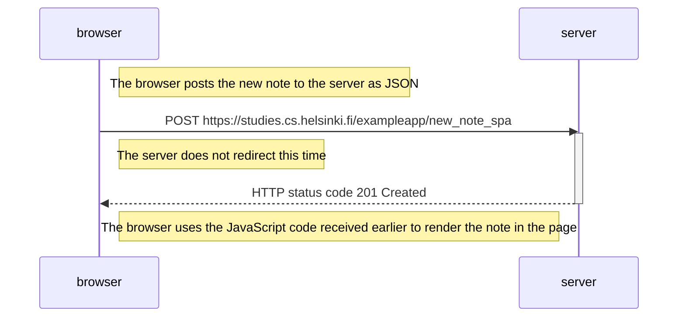

```mermaid
sequenceDiagram
    participant browser
    participant server

    Note right of browser: The browser posts the new note to the server as JSON
    browser->>server: POST https://studies.cs.helsinki.fi/exampleapp/new_note_spa
    activate server
    Note right of browser: The server does not redirect this time
    server-->>browser: HTTP status code 201 Created
    deactivate server
    Note right of browser: The browser uses the JavaScript code received earlier to render the note in the page
```